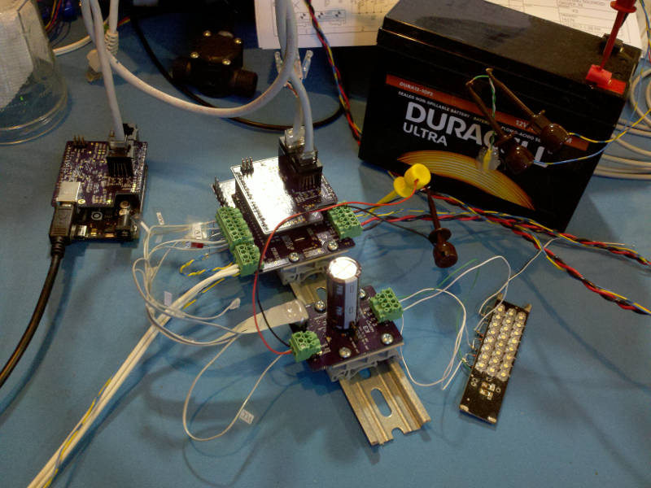
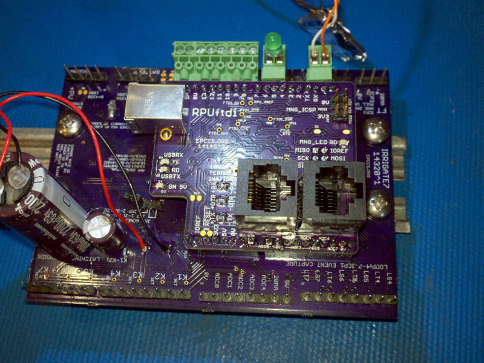
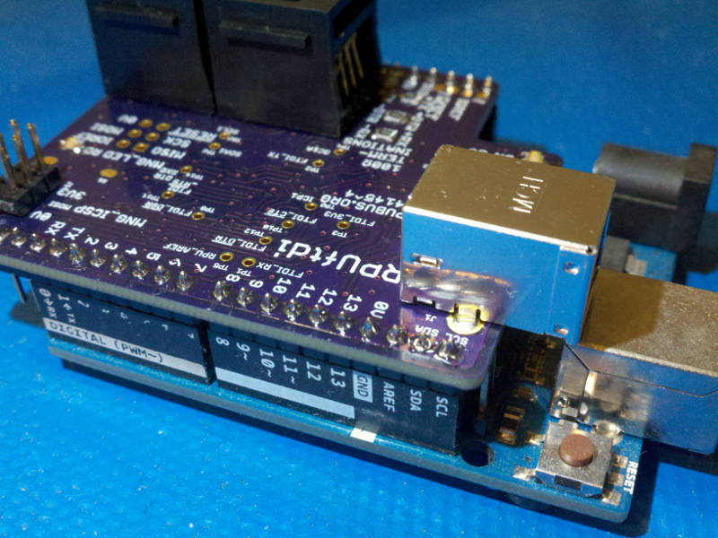
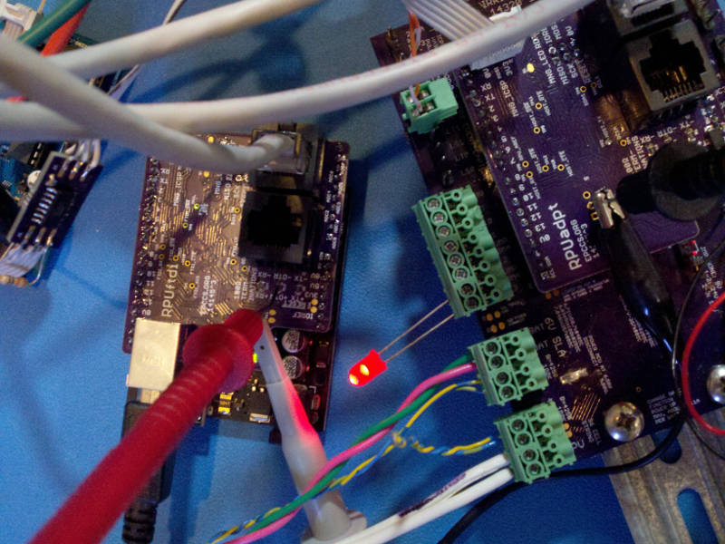
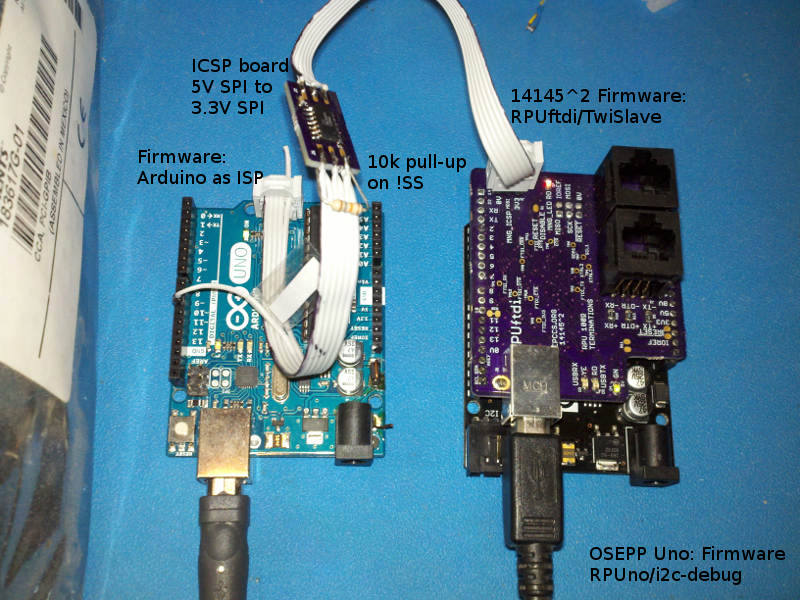
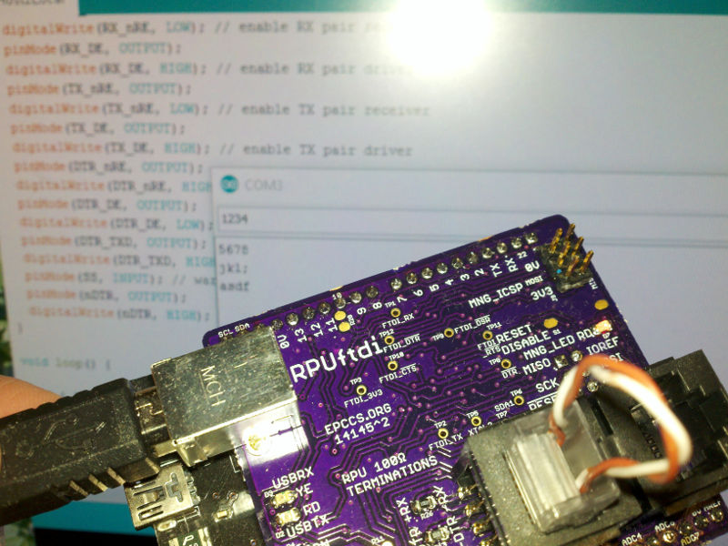

# Description

This shows the setup and method used for evaluation of RPUftdi.

# Table of References

# Table Of Contents:

6. [^4 Remote Reset of an RPUno](#4-remote-reset-of-an-rpuno)
5. [^4 Mounting](#4-mounting)
4. [^4 Bus Manager Running at 12MHz](#4-bus-manager-running-at-12mhz)
3. [^3 Proof of Concept](#3-proof-of-concept)
2. [^2 I2C Slave Operation](#2-i2c-slave-operation)
1. [^2 RS485 Full Duplex Loopback](#2-rs485-full-duplex-loopback)

## ^4 Remote Reset of an RPUno

I used an RPUftdi^4 to remotes reset an RPUno^6 with an RPUadpt^5 wired to a K3^2 board. A quick video shows picocom used to do the remote reset. 

[^4 Remote Reset Video](http://rpubus.org/Video/RPUno%5E6_RPUadpt%5E5_RPUftdi%5E4_K3%5E2_RemoteReset.mp4 "^4 Remote Reset Video")

After the reset, the bootloader runs for a few seconds and then passes control to the [Solenoid] firmware which reads an address from the RPUadpt shield over I2C and cycles through each latching coil to place them in a known state. Reading the address from RPUadpt also lets the bus manager on that board broadcast a byte on the RS-485 bus management pair (DTR) that ends the lockout placed on other devices to allow a point to point bootload connection (i.e. a return to normal point to multipoint mode).

## ^4 Mounting

Mounts on an RPUno or Irrigate7 as expected.

Mounts on an Uno with the extra pins dangling over (they are not used on the shield). 

Typically I use the RPUftdi with an Uno clone since I don't have a solar panel next to my computer. The clone is powered from the USB connection on the RPUftdi board (do not connect the USB on the clone).

## ^4 Bus Manager Running at 12MHz

Placed a 12MHz crystal on the revision 4 boards. The [Rate Calculator] shows zero framing error at 125k or 250k bits per second. Both non-standard rates that do not work with picocom 1.7. Since picocom does not handle half duplex control it really does not mater,  so I'm going to try 250k.

[Rate Calculator]: http://wormfood.net/avrbaudcalc.php

## ^3 Proof of Concept

The proof of concept (e.g. Multi-Drop Remote Bootload) used [Host2Remote] firmware on a RPUftdi^3 and [i2c-debug] on its bare metal MCU board (an OSEPP Uno R3 from fry's electronics). The remote device has [Remote] firmware on a RPUadpt^3 board mounted on an Irrigate7^1 (which is an ATmega1284p with xboot). The firmware bootloaded onto the Irrigate7^1 is [BlinkLED].

[Remote Bootload Video](http://rpubus.org/Video/14145%5E3_RPU_RemoteBootload.mp4 "Remote Bootload Video")

[Host2Remote]: https://github.com/epccs/RPUftdi/tree/master/Host2Remote
[Remote]: https://github.com/epccs/RPUadpt/tree/master/Remote
[BlinkLED]: https://github.com/epccs/Irrigate7/tree/master/BlinkLED

## ^2 I2C Slave Operation

I2C Slave operation has been checked with the [TwiSlave] firmware on a RPUftdi^2 with [i2c-debug] on an OSEPP Uno R3 (from fry's electronics).

[TwiSlave]: https://github.com/epccs/RPUftdi/tree/master/TwiSlave
[i2c-debug]: https://github.com/epccs/RPUno/tree/master/i2c-debug

## ^2 RS485 Full Duplex Loopback

Checking voltage levels and sending data through a loop back shows the RS485 TX and RX Transceivers do what is needed. Firmware Host2Local enables both TX and RX transceiver driver and receiver to check this.

