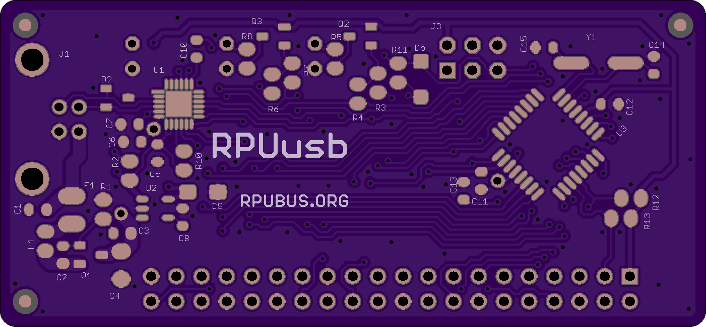
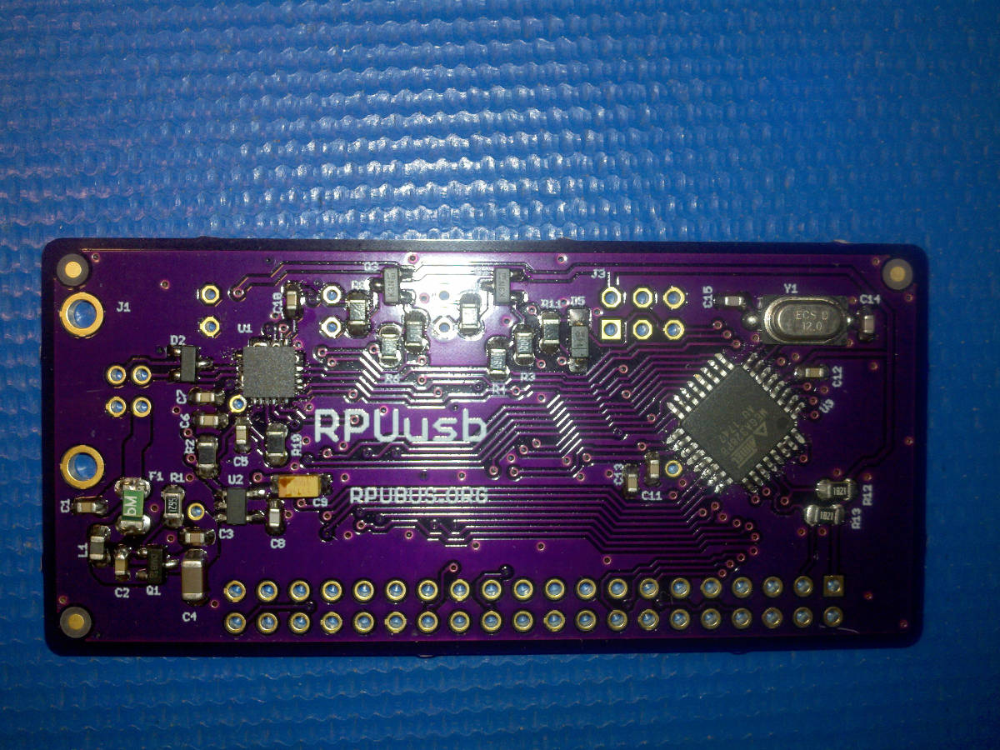
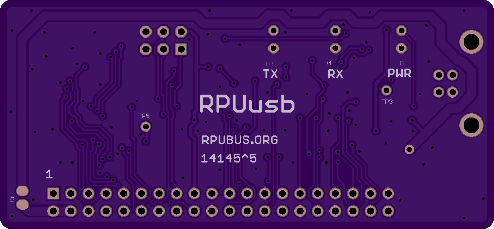
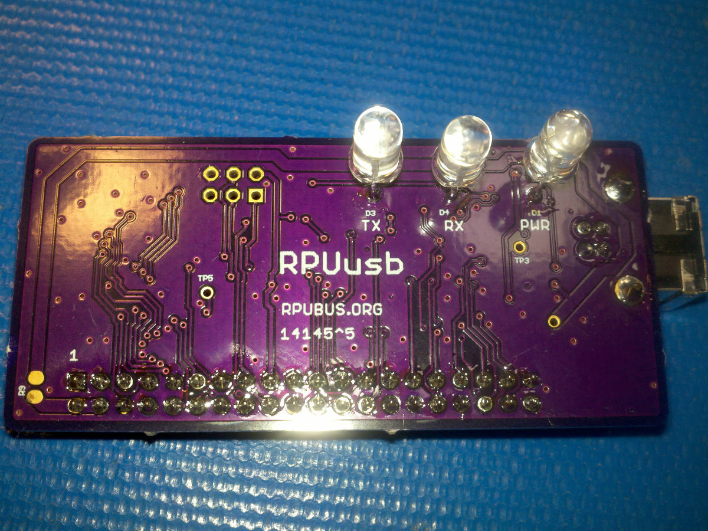

# Hardware

## Overview

Eagle Files, BOM, Status, and how to Test.


## Inputs/Outputs/Functions

* Full Duplex RS-422 multi-drop RX and TX pairs.
* Half Duplx RS-485 out of band management (DTR) pair.
* Fail Safe state (high) when differential line is undriven.
* Resting state of differential pair (RX, TX and DTR) is undriven.
* Fits RPUno.
* USB soft start prevents brownout of other devices during hot plugging.
* Power from USB (after soft start) is is given to +5V on the MCU node board.
* FTDI UART allows a HOST to connect to RX and TX pairs.
* FTDI UART nDTR and nRTS connect to BUS manager.
* I2C Interface between BUS manager and MCU node.

## Uses

* Multi-drop communication.
* Allows firmware uploads with optiboot or xboot using avrdude.
* Open Hardware, with example bus manager firmware.


# Table Of Contents

1. [Status](#status)
2. [Design](#design)
3. [Bill of Materials](#bill-of-materials)
4. [How To Use](#how-to-use)


# Status


```
        ^4 Done: Design, Layout, BOM, Review*, Order Boards, Assembly, Testing,
           WIP: Evaluation.
           Todo:  
           *during review the Design may change without changing the revision.
           location: 2017-3-17 Test Bench /w an OSEPP Uno R3

        ^3 location: 2016-10-1 Test Bench /w an OSEPP Uno R3, used to connect by CAT5 to outside parts and to bench parts as needed.
                     2017-1-5 ICP1 hacked open.
                     2017-3-17 scraped
```

Debugging and fixing problems i.e. [Schooling](./Schooling/)

Setup and methods used for [Evaluation](./Evaluation/)


# Design

The board is 0.063 thick, FR4, two layer, 1 oz copper with ENIG (gold) finish.






## Electrical Parameters (Typical)

```
TBD
USB type: FT231X
BUS manager MCU type: ATmega328p
BUS manager MCU clock: 8MHz internal
BUS manager MCU Voltage: 3.3V (e.g. IOREF is 5V)
```

## Operating Temperature

```
        0 to +70 deg C
        This is OSH so refer to the parts used for storage and operation limits.
```

## Mounting

```
        Shield for RPUno, Irrigate7, and PulseDAQ.
```

## Electrical Schematic


## Testing

Check correct assembly and function with [Testing](./Testing/)


# Bill of Materials

Import the [BOM](./Design/14145,BOM.csv) into LibreOffice Calc (or Excel) with semicolon separated values, or use a text editor.


# How To Use

RPUftdi is a shield that mounts on an RPUno or Irrigate7.


Also mounts on an Uno with the extra pins dangling over (they are not used on the shield). 


Typically I use the RPUftdi with an Uno clone since I don't have a solar panel at my bench. The clone is powered from the USB connection on the RPUftdi board (do not connect the USB on the clone).

The shield has a bus manager MCU that is used to control the RS-422 transceivers. I program it with an ISP tool using avrdude. The [Toolchain] is found on Ubuntu and Raspbian. For the ISP tool, I use an SPI level converter since the bus manager is at 3.3V and load an Uno board with the ArduinoISP sketch from Arduino.cc IDE (1.6.7+) example sketches. Firmware examples (most used for testing) are found in other folders of this repository, but the one I primarily use is [Host2Remote].

[Toolchain]: https://github.com/epccs/RPUftdi#avr-toolchain
[Host2Remote]: https://github.com/epccs/RPUftdi/tree/master/Host2Remote

__Warning:__ the RPUftdi bus manager is powered with 3.3V so a 5V  ICSP tool needs to have a level converter.

Note: Obtaining a rugged ISP tool is a dilemma, I would like to suggest an AVRISP mkII but Atmel no longer makes them. I have an AVR Dragon and it is working with avrdude on Ubuntu and Raspbian but it is not very rugged so I normally use the Arduino ISP sketch and a level shifter for the MOSI, MISO, and SCK pins.

The CAT5 needs wired just like an Ethernet cable following [T568A] or T568B method. 

[T568A]: http://en.wikipedia.org/wiki/Category_5_cable

Grounding should occur at one location only. The host frame will connect the USB to ground which also runs through the CAT5. Unfortunately, the ground wires within CAT5 will not survive a lightning strike and will bring it to the host. To reduce the risk, run a #14 AWG ground wire between the remote device(s) and the ground system connected to the host chassis. Tie the 0V of each remote device to the ground with a 100k resistor. Also, the host chassis needs a good (#14 AWG or larger) wire to the ground system.
