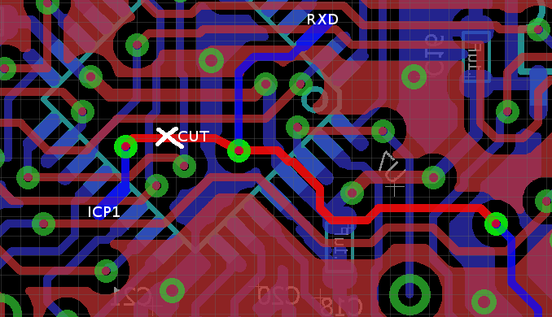

# Description

Some lessons I learned doing RPUftdi.

# Table Of Contents:

1. [^4 Power Chopping](#4-power-chopping)
1. [^3 Baud Rate](#3-baud-rate)
1. [^3 Bus Manager ICP1 Used to Hault Host](#3-bus-manager-icp1-used-to-hault-host)
1. [^3 FT231X Problem Toggling nDTR and nRTS](#3-ft231x-problem-toggling-ndtr-and-nrts)
1. [^2 I2C Level Converter](#2-i2c-level-converter)
1. [^2 Brick Bus Management MCU](#2-brick-bus-management-mcu)

## ^4 Power Chopping

Transceivers start and stop (chop) the power flow over the USB cable; occasionally it results in a reset of the host computer. Mixing power and data is risky; the next version of this board should not power the transceivers from the USB.

## ^3 Baud Rate 

The [Bit Rate] error at 115.2k is too high (though it mostly works). I have not seen errors on Windows yet but am seeing them on Linux. Looking at the [Rate Calculator] I see 76.8k is very good, but the picocom packaged on Ubuntu does not support it. The next very good rate is 38.4k which picocom does support. The bootloader does a CRC check with each line in the hex file so running it 115.2k is fine, it will redo the chunks with errors. However, I don't want to see any errors while running commands (that would look bad during a demo).

Note: [Baud] is the wrong term, but is the one everyone knows.

[Rate Calculator]: http://wormfood.net/avrbaudcalc.php
[Baud]: https://en.wikipedia.org/wiki/Baud
[Bit Rate]: https://en.wikipedia.org/wiki/Bit_rate#Gross_bit_rate

## ^3 Bus Manager ICP1 Used to Hault Host

Connect bus manager ICP1 pin to a test point rather than DTR transceiver. RPUpi is using it to shutdown/halt the host computer. Cut the indicated PCB trace to open the ICP1 pin.

## ^3 FT231X Problem Toggling nDTR and nRTS

This problem is not hardware, it was caused because I wrote the Host2Local firmware as though nSS was connected to nRESET directly but that is not the case. I have an open drain buffer between them so when  nSS went high impedance it did not pull up the buffer and the MCU did not turn on after reset. I am still confused why nDTR and nRTS did not pull up but they seem to be working as expected (on both Linux and Windows) now that I set nSS as an output with a high and low state (as opposed to a low and high-z state).

## ^2 I2C Level Converter

If I2C has a pull-up to 3.3V then the level converter is not needed. Arduino's IDE Wire C++ class turns on the ATmega328 internal pull-ups which raise the voltage above 3.3, e.g. I read 3.5V for an undriven bus, which is probably fine but it confused and was not expected. After un-wrapping the TWI code from the Wire class and getting it to run with the vanilla avr-libc I found the pull-up code and turned it into an option during initialization.

## ^2 Brick Bus Management MCU

R20 (jumpered by default) was used to connect a local MCU (SS from a Uno) to reset the bus manager. Unfortunaly when the bootloader programs the local boad it seems to play with the SPI interface and ends up setting the flages of the bus manager to zero. This effectivly bricks the part, though the flags can be set with a parall programing setup (which I may do after collecting a few bricks).

SPI to the bus manager has been removed. 
