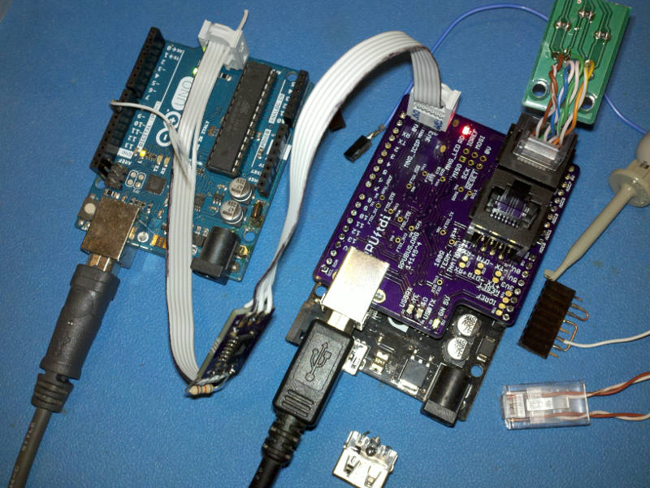

# Description

This is a list of Test preformed on each RPUftdi after assembly.

# Table of References


# Table Of Contents:

1. [Basics](#basics)
2. [Assembly check](#assembly-check)
3. [IC Solder Test](#ic-solder-test)
4. [Bias USB 5V and Check LDO Regulators](#bias-usb-5v-and-check-ldo-regulators)
5. [Set MCU Fuse](#set-mcu-fuse)
6. [Load CheckDTR Firmware](#load-checkdtr-firmware)
7. [Check Differential Bias](#check-differential-bias)
8. [Differential Loopback with TX Driver](#differential-loopback-with-tx-driver)
9. [USB Power Up](#usb-power-up)
10. [Load i2c-debug into an MCU board](#load-i2c-debug-into-an-mcu-board)
11. [I2C Slave test](#i2c-slave-test)


## Basics

These tests are for an assembled RPUftdi board 14145^5 which may be referred to as a Unit Under Test (UUT). If the UUT fails and can be reworked then do so, otherwise it needs to be scraped. 

**Warning: never use a soldering iron to rework ceramic capacitors due to the thermal shock.**
    
Items used for test.




## Assembly check

After assembly check the circuit carefully to make sure all parts are soldered and correct, note that the device making is labeled on the schematic and assembly drawing.
    

## IC Solder Test

Check continuity between pin and pad by measuring the reverse body diode drop from 0V (aka ground) and all other IC pads not connected to 0V. This value will vary somewhat depending on what the pin does, but there is typically an ESD diode to ground or sometimes a body diode (e.g. open drain MOSFET), thus a value of .3V to .7V is valid to indicate a solder connection. Note the RS485 drivers will show high impedance on the differential lines, so skip those.


## Bias USB 5V and Check LDO Regulators

Connect a 5V supply with CC mode set at 30mA to the USB input. Verify that the 5V gets through the fuse and soft start circuit to the +5V pin. Turn off power. 

Connect a 5V supply with CC mode set at 30mA to the the USB +5V input. Measure that the the MIC5205 (U2) linear regulator has 3.3V (J2 pin 1). Measure the input current of a blank MCU. Turn off power.

```
{   "I_IN_BLANKMCU_mA":[1.44,],
    "LDO_V":[3.41,] }
^4
{   "I_IN_BLANKMCU_mA":[4.5,4.5,4.3,4.4,],
    "LDO_V":[3.3,3.3,3.28,3.28,] }
```


## Set MCU Fuse

Install Git and AVR toolchain on Ubuntu (20.04). 

```
sudo apt-get install git gcc-avr binutils-avr gdb-avr avr-libc avrdude
```

Clone the RPUftdi repository.

```
cd ~
git clone https://github.com/epccs/RPUftdi
cd RPUftdi/Bootload
```

Connect a 5V supply with CC mode set at 30mA to the +5V (J7 pin 4) and  0V (J7 pin 2). Connect the ICSP tool (J9). The MCU needs its fuses set, so run the Makefile rule to do that. 

```
make fuse
```

Note: There is not a bootloader, it just sets fuses.

Disconnect the ICSP tool and measure the input current for 12Mhz crystal at 3.3V. It takes a long time to settel.

```
{   "I_IN_MCU_12MHZ_LP-CRYSTAL_mA":[7.3,7.3,7.2,7.1,7.1,7.2,7.1,]}
# old values for referance only
{   "I_IN_MCU_8MHZ_INTRN_mA":[6.3,6.2,6.0,6.1]}
```


## Load CheckDTR Firmware

Plug a header (or jumper) onto the +5V pin so that IOREF is jumpered to +5V. Connect TX pin to IOREF to pull it up (the MCU normaly does this). Plug a CAT5 RJ45 stub with 100 Ohm RX, TX and DTR pair terminations. Connect a 5V supply with CC mode set at 50mA to the +5V that was jumpered to IOREF (J7 pin 4) and  0V (J7 pin 2). Connect the ICSP tool (J9).

Use the command line to select the CheckDTR source working directory. Run the makefile rule used to load CheckDTR firmware that verifies DTR control is working:

```
cd ~RPUftdi/CheckDTR
make isp
```

The program loops through the test. It blinks the red LED to show which test number is setup. If it keeps repeating a test then that test has failed.

As the firmware loops the input current can be measured, it should have two distinct levels, one when the DTR pair is driven low and one when the DTR pair is not driven. The blinking LED leaves the DMM unsettled. Measure that FTDI_3V3 has 3.3V (TP3).

```
{   "DTR_HLF_LD_mA":[36.8,34.1,35.3,34.9,35.0,],
    "DTR_NO_LD_mA":[13.7,11.5,12.1,11.9,12.0,],
    "FTDI_3V3_V":[3.275,3.305,3.311,3.265,] }
```


##  Check Differential Bias

Plug a header (or jumper) onto the +5V pin so that IOREF is jumpered to +5V. Connect TX pin to 0V to pull it down to simulate the MCU sending data. The CheckDTR firmware will set TX_DE and RX_DE high. Connect a 5V supply with CC mode set at 100mA to the +5V that was jumpered to IOREF (J7 pin 4) and 0V (J7 pin 2). 

Check  that the input current is cycling between 56mA and 33mA. At 56mA the TX driver is driving the TX pair with half load and DTR driver is driving the DTR pair with a half load, while ony the TX pair is driven at 33mA. 

```
{   "DTR_TX_HLF_LD_mA":[59.4,56.5,57.7,57.2,57.1,],
    "TX_HLF_LD_mA":[36.5,33.8,35.0,34.2,34.1] }
```


## Differential Loopback with TX Driver


Same as Differential Bias test with a plug in a RJ45 loopback connector to connect the TX differential pair to the RX differential pair and the input current. The TX driver is now driving a differential pair with 50 Ohms on it, which is the normal load. Verify that RX has 0V on it now.

NOTE: the RX Driver is directly connected by FTDI_TX to the FTDI chip pin, if the FTDI_TX node were to be pulled down to test the RX driver the FTDI chip would not stop trying to pull it up and be damaged.

```
{   "DTR_HLF_LD_TX_FL_LD_mA":[76.5,73.8,75.1,74.5,74.2,],
    "TX_FL_LD_mA":[53.0,51.0,52.0,51.5,51.2,] }
```

Turn off power. 


## USB Power Up

Plug a header (or jumper) onto the +5V pin so that IOREF is jumpered to +5V. Plug in a jumper from TX to RX pins, which normaly go to the MCU board.

On Linux use the dmesg command to see latest device mesages then plug the USB input to a powered hub that was previously connected and use dmesg to verify that the new USB port shows up. Then use picocom to connect to it.

```
rsutherland@conversion:~/RPUftdi/CheckDTR$ dmesg
...
[20662.404039] usb 1-4.3: new full-speed USB device number 6 using ehci-pci
[20662.502768] usb 1-4.3: New USB device found, idVendor=0403, idProduct=6015
[20662.502781] usb 1-4.3: New USB device strings: Mfr=1, Product=2, SerialNumber=3
[20662.502792] usb 1-4.3: Product: FT231X USB UART
[20662.502801] usb 1-4.3: Manufacturer: FTDI
[20662.502812] usb 1-4.3: SerialNumber: DA01LX0U
[20662.512277] ftdi_sio 1-4.3:1.0: FTDI USB Serial Device converter detected
[20662.512328] usb 1-4.3: Detected FT-X
[20662.512686] usb 1-4.3: FTDI USB Serial Device converter now attached to ttyUSB0
...
rsutherland@conversion:~/RPUftdi/CheckDTR$ picocom -b 38400 /dev/ttyUSB0
```

Verify each character echo's. Turn off power (unplug USB).


## Load i2c-debug into an MCU board

Plug the DUT into a ATmega328p MCU board (e.g. RPUno). Connect USB from a host computer to the RPUftdi to power the bus manager. Connect the ICSP tool (J9).

Use the command line to select the Host2Remote source working directory. Run the makefile rule used to load Host2Remote firmware.

```
cd ~RPUftdi/Host2Remote
make isp
```

Use picocom to connect, and verify that the red MNG_LED blinks. The DUT's red MNG_LED blinks when the UART pulls DTR active. Exit picocom with C-a, C-x. The MNG_LED should stop blinking after picocom exits.

```
picocom -b 38400 /dev/ttyUSB0
```

Now load the i2c-debug firmware onto the RPUno board through the DUT. Watch the yellow USBRX and red USBTX to verify they are working. 

```
cd ~RPUno/i2c-debug
make bootload
```

Remove power by pulling the USB plug. 

Note: The serial bootload has to travel out the FTDI_TX line and into the RX transceiver driver (which also enables it). The RX differential pair is thus driven and seen by all the differential receivers on the RX pair. The RX pair receiver drives the bare metal RX line when it is enabled by the bus manager. The direction data flows is changed but it works similarly from the bare metal TX line to the FTDI_RX line.


## I2C Slave test

With i2c-debug loaded in the RPUno board under the DUT hotplug the USB to the RPUftdi board. If BUILTIN_LED is connected it will blink at 0.5Hz (1 sec on, and 1 sec off) when I2C reads correctly.

Note: hotplugging can brownout power to other USB devices when the plugged device does not implement a soft start circuit, but the RPUftdi should not cause such brownouts because it has a soft start.

Note: For reference, the Host2Remote firmware uses the DTR pair to maintain a state machine. When picocom connects it will broadcast a byte on the DTR pair that other bus managers can receive. The following will use I2C command 0x03 (implemented in Host2Remote) to set the address ('1' or 0x31) that is broadcast when a host computer pulls the FTDI_nDTR active.

```
rsutherland@conversion:~/Samba/RPUftdi/CheckDTR$ picocom -b 38400 /dev/ttyUSB0
...
/0/id?
{"id":{"name":"I2Cdebug","desc":"RPUno Board /w atmega328p and LT3652","avr-gcc":"4.9"}}
/0/scan?
{"scan":[{"addr":"0x29"}]}
/0/address 41
{"address":"0x29"}
/0/buffer 3,49
{"txBuffer":["data":"0x3","data":"0x31"]}
/0/write
{"returnCode":"success"}
/0/read? 2
{"rxBuffer":[{"data":"0x3"},{"data":"0x31"}]}
```

Since there is no address '1' the RPUftdi bus manager LED will blink slow until the bootload timout is done, a power cycle will reset the bootload address to '0'.
