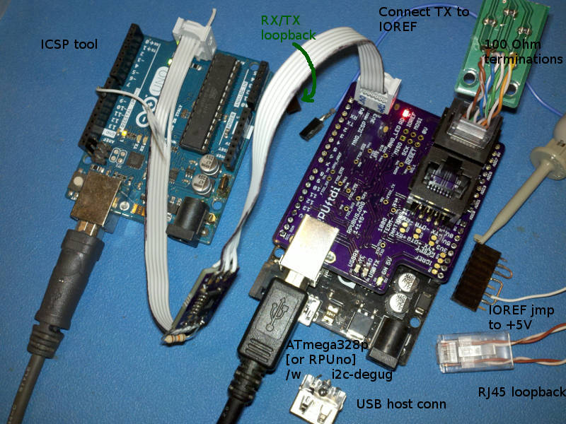

# Description

This is a list of Test preformed on each RPUftdi after assembly.

# Table of References


# Table Of Contents:

1. [Basics](#basics)
2. [Assembly check](#assembly-check)
3. [IC Solder Test](#ic-solder-test)
4. [Bias USB 5V and Check LDO Regulators](#bias-usb-5v-and-check-ldo-regulators)
5. [Set MCU Fuse](#set-mcu-fuse)
6. [Load CheckDTR Firmware](#load-checkdtr-firmware)
7. [Check Differential Bias](#check-differential-bias)
8. [Differential Loopback with TX Driver](#differential-loopback-with-tx-driver)
9. [USB Power Up](#usb-power-up)
10. [Load i2c-debug into an MCU board](#load-i2c-debug-into-an-mcu-board)
11. [I2C Slave test](#i2c-slave-test)


## Basics

These tests are for an assembled RPUno board 14145^3 which may be referred to as a Unit Under Test (UUT). If the UUT fails and can be reworked then do so, otherwise it needs to be scraped. 

**Warning: never use a soldering iron to rework ceramic capacitors due to the thermal shock.**
    
Items used for test.




## Assembly check

After assembly check the circuit carefully to make sure all parts are soldered and correct, note that the device making is labeled on the schematic and assembly drawing.
    

## IC Solder Test

Check continuity between pin and pad by measuring the reverse body diode drop from 0V (aka ground) and all other IC pads not connected to 0V. This value will vary somewhat depending on what the pin does, but there is typically an ESD diode to ground or sometimes a body diode (e.g. open drain MOSFET), thus a value of .3V to .7V is valid to indicate a solder connection. Note the RS485 drivers will show high impedance on the differential lines, so skip those.


## Bias USB 5V and Check LDO Regulators

Apply a 5V current limited source (about 30mA*) to the USB input. Verify that the 5V gets through the fuse and soft start circuit to the +5V pin. Check that the the MIC5205 linear regulator has 3.3V (use ICSP J9 pin2 on ^3).  Check that the input current for a blank MCU is less than 10mA. Turn off power.

```
{   "I_IN_BLANKMCU_mA":[5.5,],
    "LDO_V":[3.29,] }
```

## Set MCU Fuse

The MCU needs its fuses set, so a Makefile (e.g. "make fuse") is used to do that. There is not a bootloader, it just sets fuses.

Use the <https://github.com/epccs/RPUftdi/tree/master/Bootload> Makefile 

Check that the input current is suitable for 8Mhz at 3.3V.

```
{   "I_IN_MCU_8MHZ_INTRN_mA":[8.5,]}
```


## Load CheckDTR Firmware

Increase current limit to 50mA and load (e.g. "make isp") CheckDTR firmware to verify DTR control is working:

Use the <https://github.com/epccs/RPUftdi/tree/master/CheckDTR> Makefile

The program loops through the test. It blinks the red LED to show which test number is setup. If it keeps repeating a test then that test has failed.

As the firmware loops the input current can be measured, it should have two distinct levels, one when the DTR pair is driven low and one when the DTR pair is not driven. The blinking LED leaves the DMM unsettled.

```
{   "DTR_HLF_LD_mA":[36.8,],
    "DTR_NO_LD_mA":[13.7,] }
```


##  Check Differential Bias

Plug a header (or jumper) onto the +5V pin so that IOREF is jumpered to  +5V, set current limit at 100mA. Connect TX pin to IOREF to pull it up (the MCU normaly does this). Use the CheckDTR firmware to set TX_DE and RX_DE high. Now power up the +5V. Check that both RX and TX have 5V. Check that TX_DI has 3.3V (U2 pin 4 on ^3) and its TX_DE control (U2 pin 3 on ^3) is pulled low. Check that FTDI_TX has 3.3V (TP2 on ^3). Check that RX_DE (U6 pin 3 on ^3) is pulled low. 

Now disconnect TX from IOREF and connect it to 0V, to simulate the MCU sending data. Check  that the input current is cycling between 56mA and 33mA. At 56mA the TX driver is driving the TX pair with half load and DTR driver is driving the DTR pair with a half load, while ony the TX pair is driven at 33mA. 

```
{   "DTR_TX_HLF_LD_mA":[59.4,],
    "TX_HLF_LD_mA":[36.5,] }
```


## Differential Loopback with TX Driver

Plug in a RJ45 loopback connector to connect the TX differential pair to the RX differential pair and the input current. The TX driver is now driving a differential pair with 50 Ohms on it, which is the normal load. Verify that RX has 0V on it now. Turn off power. 

NOTE: the RX Driver is directly connected by FTDI_TX to the FTDI chip, if it were to be pulled down to test the RX driver the FTDI chip would be damaged.

```
{   "DTR_HLF_LD_TX_FL_LD_mA":[76.5,],
    "TX_FL_LD_mA":[53.0,] }
```


## USB Power Up

__Warning:__ a powerd USB hub offers no protection, this needs improved.

On Linux use the dmesg command to see latest device mesages then plug the USB input to a powered hub that was previously connected and use dmesg to verify that the new USB port shows up. Then use picocom to connect to it.

```
rsutherland@conversion:~/Samba/RPUftdi/CheckDTR$ dmesg
...
[54874.888730] usbcore: registered new interface driver ftdi_sio
[54874.889210] usbserial: USB Serial support registered for FTDI USB Serial Device
[54874.889728] ftdi_sio 1-4.3:1.0: FTDI USB Serial Device converter detected
[54874.889933] usb 1-4.3: Detected FT-X
[54874.890522] usb 1-4.3: FTDI USB Serial Device converter now attached to ttyUSB0
...
rsutherland@conversion:~/Samba/RPUftdi/CheckDTR$ picocom -b 115200 /dev/ttyUSB0
```

Plug in a jumper from TX to RX pins and verify each character echo's. Turn off power (unplug USB).

Note: using the RJ45 loopback will not echo unless the TX input is pulled high, but the above test has already gone on the differential pairs so the RJ45 loopback is not needed. 


## Load i2c-debug into an MCU board

Plug the DUT into a bare metal MCU board (e.g. RPUno). Connect a USB to the RPUftdi, which should prvide 3.3V for RPUftdi bus manager, and load (e.g. "make isp") the Host2Remote firmware. 

Use the <https://github.com/epccs/RPUftdi/tree/master/Host2Remote> Makefile

Use picocom to connect, and verify that the red MNG_LED blinks. The DUT's red MNG_LED blinks when the UART pulls DTR active. Exit picocom with C-a, C-x. The MNG_LED should stop blinking after picocom exits.

Now load (e.g. "make bootload") the i2c-debug firmware onto the bare metal MCU board (e.g. an RPUno) through the DUT. Watch the yellow USBRX and red USBTX to verify they are working. Remove power by pulling the USB plug. 

Use the <https://github.com/epccs/RPUno/tree/master/i2c-debug> Makefile

Note: The serial bootload has to travel out the FTDI_TX line and into the RX transceiver driver (which also enables it). The RX differential pair is thus driven and seen by all the differential receivers on the RX pair. The RX pair receiver drives the bare metal RX line when it is enabled by the bus manager. The direction data flows is changed but it works similarly from the bare metal TX line to the FTDI_RX line.


## I2C Slave test

With i2c-debug loaded in the MCU board (e.g. an RPUno) on the DUT hotplug the USB to the RPUftdi board. If BUILTIN_LED is connected it will blink at 0.5Hz (1 sec on, and 1 sec off) when I2C reads correctly.

Note: hotplugging can brownout power to other USB devices when the plugged device does not implement a soft start circuit, but the RPUftdi should not cause such brownouts because it has a soft start.

Note: For reference, the Host2Remote firmware uses the DTR pair to maintain a state machine. When picocom connects it will broadcast a byte on the DTR pair that other bus managers can receive. The following will use I2C command 0x03 (implemented in Host2Remote) to set the address that is broadcast when a host computer pulls the FTDI_nDTR active.

```
rsutherland@conversion:~/Samba/RPUftdi/CheckDTR$ picocom -b 115200 /dev/ttyUSB0
...
/0/id?
{"id":{"name":"I2Cdebug","desc":"RPUno Board /w atmega328p and LT3652","avr-gcc":"4.9"}}
/0/scan?
{"scan":[{"addr":"0x29"}]}
/0/address 41
{"address":"0x29"}
/0/buffer 3,0
{"txBuffer":["data":"0x3","data":"0x0"]}
/0/write
{"returnCode":"success"}
/0/read? 2
{"rxBuffer":[{"data":"0x3"},{"data":"0x0"}]}
```


