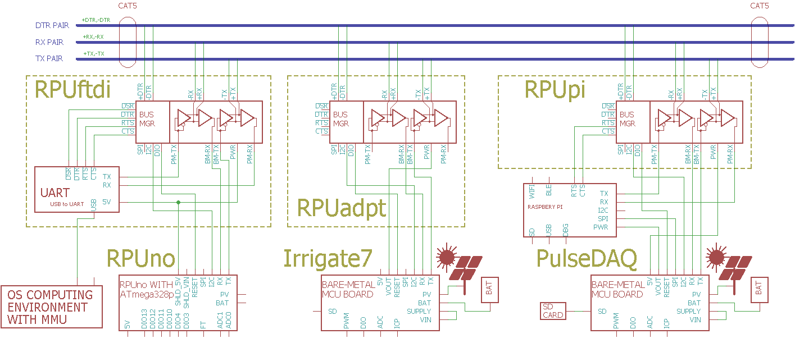

# RPUftdi

From <https://github.com/epccs/RPUftdi>

## Overview

Shield used to connect a controller board to full duplex RS-422 (RX and TX pairs). An out of band half duplex RS-485 (DTR pair) is used for management. CAT5 with RJ-45 connectors is used to run the pairs. It results in a serial bus between a host with USB and a local controller board (e.g. [RPUno]) that can be extended as multi drops through additional [RPUadpt].

[RPUpi]: https://github.com/epccs/RPUpi
[RPUadpt]: https://github.com/epccs/RPUadpt
[RPUno]: https://github.com/epccs/RPUno
[Irrigate7]: https://github.com/epccs/Irrigate7

[Forum](https://rpubus.org/bb/viewforum.php?f=5)

[HackADay](https://hackaday.io/project/15585-rpuftid)

## Status

[Available](https://rpubus.org/Order_Form.html)


This shield is programmed with an in-circuit serial programming tool that is able to handle the 3.3V ATmega328p target. I use an Arduino Uno with the [ArduinoISP] sketch and an SPI level shifter (e.g. [ICSP]). A Raspberry Pi should also work with the avrdude bit-bang (-c linuxgpio) or SPI (-c linuxspi) modes.

[ICSP]: https://github.com/epccs/Driver/tree/master/ICSP

[ArduinoISP]: https://github.com/arduino/Arduino/blob/master/build/shared/examples/11.ArduinoISP/ArduinoISP/ArduinoISP.ino

## [Hardware](./Hardware)

Hardware files and notes for referance.


## Example

This multi-drop serial bus allows multiple controller boards to be connected to a host serial port (UART). Crossover of the serial from the host computer occurs as it enters the transceivers on the shield. The differential pair from the transceives is run through a patch cable (CAT5) between the controllers, so all the controllers see the same interface. The transceivers differential driver is automatically enabled when a UART pulls its output low, which means no software [magic] is needed to operate a push to talk based system, though it is up to the user software to ensure the controllers talk in a reasonable way (e.g. without collision). The bus transceivers can't cross conduct while trying to drive the differential pair (e.g. when multiple devices with the same address answer, or more likely my firmware is barking at the shadows).

[magic]: https://github.com/pyserial/pyserial/blob/master/serial/rs485.py



In the examples, I have for [RPUno] a command processor accepts interactive textual commands and operates the peripherals. The examples have a simple makefile that compiles the microcontroller firmware from the source. The host I use has Ubuntu (or Raspbian) with the AVR toolchain installed.

The makefile has a rule (e.g. "make bootload") that uploads to the targets bootloader with avrdude. Since the transceiver control [magic] is pushed into the bus manager, avrdude can work (the bus manager initializes a point to point mode with a 25 second time to live when the host becomes active). 

When PySerial on the host opens the serial port it pulls the nDTR line low (it is active low) and that tells the manager running [Host2Remote] firmware to reset the bootload address (broadcast on DTR pair). PySerial needs to wait for a few seconds so the bootloader timeout finishes. The RPUno application needs to read the RPUftid serial address over I2C so that the RPUftdi bus manager knows to connect the RPUno's serial lines to the multi-drop bus (and end the bootload mode immediately).

[Host2Remote]: ./Host2Remote

When avrdude opens the serial port it pulls the nDTR line low and the manager broadcast the bootload address which places everything in lockout except the host and the microcontroller board that was addressed. The address is held in the manager on the shield so replacing the [RPUno] dos not change that locations address, but replacing the [RPUadpt] does.

## AVR toolchain

The core files for this board are in the /lib folder. Each example has its files and a Makefile in its own folder. The toolchain packages that I use are available on Ubuntu and Raspbian. 

```
sudo apt-get install git make gcc-avr binutils-avr gdb-avr avr-libc avrdude
git clone https://github.com/epccs/RPUadpt
```

* [gcc-avr](https://packages.ubuntu.com/search?keywords=gcc-avr)
* [binutils-avr](https://packages.ubuntu.com/search?keywords=binutils-avr)
* [gdb-avr](https://packages.ubuntu.com/search?keywords=gdb-avr)
* [avr-libc](https://packages.ubuntu.com/search?keywords=avr-libc)
* [avrdude](https://packages.ubuntu.com/search?keywords=avrdude)
