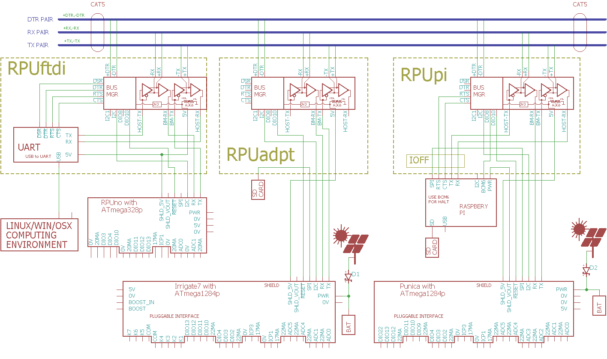

# RPUftdi

From <https://github.com/epccs/RPUftdi>

## Overview

Shield used to connect a microcontroller and a USB host to a full duplex RS-422 (RX and TX pairs) and an out of band half duplex RS-485 (DTR pair) over CAT5. It's a multidrop bus between a host (e.g. Pi Zero on [RPUpi] or no host with [RPUadpt]) and an MCU board (e.g. [RPUno]).

[HackADay](https://hackaday.io/project/15585-rpuftid)

[Forum](http://rpubus.org/bb/viewforum.php?f=5)

[OSHpark](https://oshpark.com/shared_projects/7gJOSPpM)

[RPUno]: https://github.com/epccs/RPUno
[RPUpi]: https://github.com/epccs/RPUpi
[RPUadpt]: https://github.com/epccs/RPUadpt

## Status

## [Hardware](./Hardware)

Hardware files are in Eagle, there is also some testing, evaluation, and schooling notes for referance.

## Example

A host computer controls the microcontrollers through the FTDI serial (UART) interface. The microcontrollers run a command processor which accepts interactive textual commands and operates the peripherals as a bare metal system. The microcontroller firmware can be compiled from source that is version managed on GitHub, and then uploaded to the targets bootloader with avrdude. The host can be desktop development machine or remotely accessed (e.g. SSH).

## AVR toolchain

* sudo apt-get install [gcc-avr]
* sudo apt-get install [binutils-avr]
* sudo apt-get install [gdb-avr]
* sudo apt-get install [avr-libc]
* sudo apt-get install [avrdude]
    
[gcc-avr]: http://packages.ubuntu.com/search?keywords=gcc-avr
[binutils-avr]: http://packages.ubuntu.com/search?keywords=binutils-avr
[gdb-avr]: http://packages.ubuntu.com/search?keywords=gdb-avr
[avr-libc]: http://packages.ubuntu.com/search?keywords=avr-libc
[avrdude]: http://packages.ubuntu.com/search?keywords=avrdude