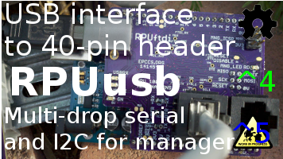

# RPUusb

From <https://github.com/epccs/RPUusb>

## Overview

Alow a desktop or other host with USB to interface with [Gravimetric] that have an R-Pi header. It has two UARTs that can together operate the multi-drop serial. 

[Gravimetric]: https://github.com/epccs/Gravimetric

## Status

This board has a known problem with managers that lack power domains that allow one side to power down, that is to say if it has power and the application does not then the manager on the application board will be damaged. It is my hope that I can figure out how to use one of the new AVR-DB chips as a manager to fix this problem.



This is programmed with an in-circuit serial programming tool that is able to handle the 3.3V ATmega328pb target. I use an Arduino Uno with the [ArduinoISP] sketch and an SPI level shifter.

[ICSP]: https://github.com/epccs/Driver/tree/master/ICSP

[ArduinoISP]: https://github.com/arduino/Arduino/blob/master/build/shared/examples/11.ArduinoISP/ArduinoISP/ArduinoISP.ino

## [Hardware](./Hardware)

Hardware files and notes for referance.


## Example

TBD

## AVR toolchain

The core files for this board are in the /lib folder. Each example has its files and a Makefile in its own folder. The toolchain packages that I use are available on Ubuntu, Raspbian and Windows with WSL and Ubuntu installed. 

```
sudo apt-get install git make gcc-avr binutils-avr gdb-avr avr-libc avrdude
git clone https://github.com/epccs/RPUusb
```

* [gcc-avr](https://packages.ubuntu.com/search?keywords=gcc-avr)
* [binutils-avr](https://packages.ubuntu.com/search?keywords=binutils-avr)
* [gdb-avr](https://packages.ubuntu.com/search?keywords=gdb-avr)
* [avr-libc](https://packages.ubuntu.com/search?keywords=avr-libc)
* [avrdude](https://packages.ubuntu.com/search?keywords=avrdude)
